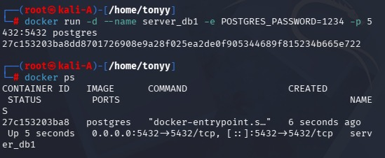
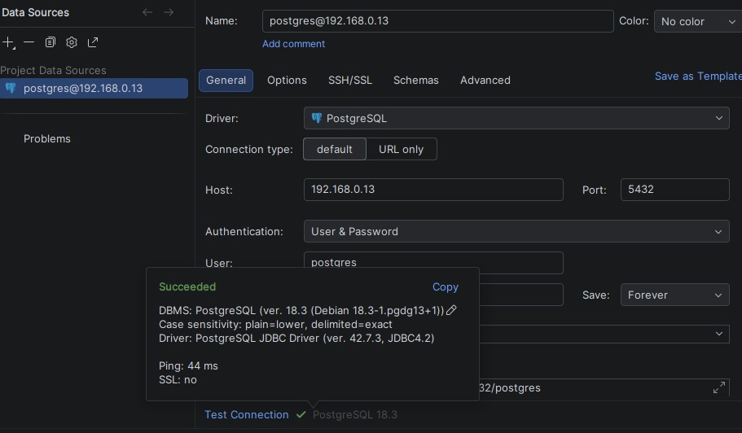
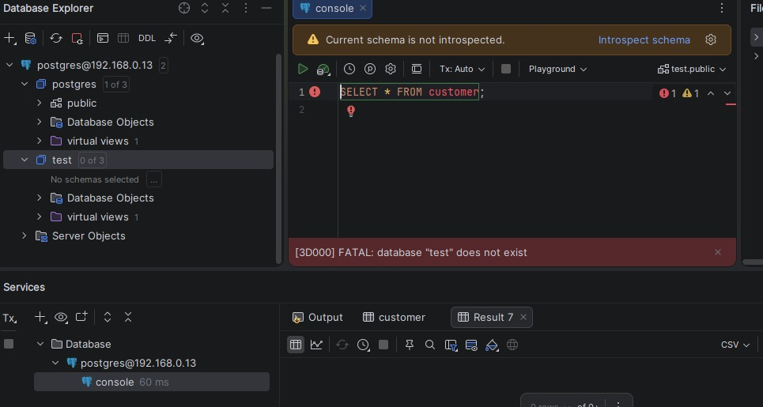
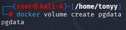
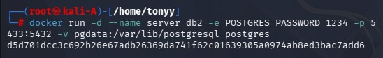
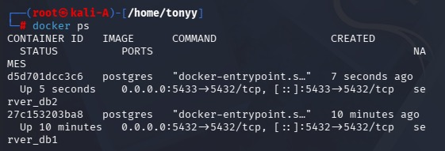
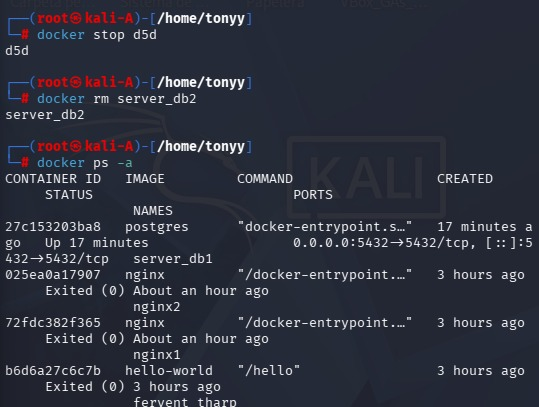
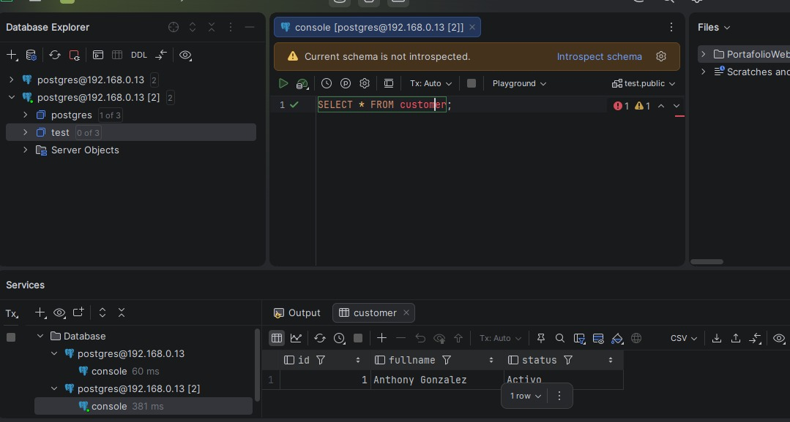

# Práctica No. 3

## Crear volúmenes para persistir base de datos con PostgreSQL usando Docker

---

# 1. Título

Implementación de volúmenes en Docker para persistencia de datos en una base de datos PostgreSQL.

---

# 2. Tiempo de duración

120 minutos

---

# 3. Fundamentos

Docker es una plataforma que permite crear, ejecutar y administrar aplicaciones dentro de contenedores. Un contenedor es un entorno aislado que contiene todo lo necesario para que una aplicación funcione correctamente, incluyendo librerías, dependencias y configuraciones. Gracias a esto, una aplicación puede ejecutarse de la misma manera en diferentes sistemas operativos sin conflictos de instalación.

Uno de los usos más comunes de Docker es ejecutar servidores y bases de datos dentro de contenedores. Sin embargo, cuando se utilizan bases de datos dentro de contenedores existe un problema importante relacionado con el almacenamiento de información. Los contenedores están diseñados para ser temporales, lo que significa que si un contenedor se elimina, toda la información almacenada dentro de él también desaparece.

Para solucionar este problema Docker ofrece una herramienta llamada **volúmenes (Docker Volumes)**. Los volúmenes permiten guardar datos fuera del contenedor, directamente en el sistema anfitrión. De esta forma, aunque el contenedor sea eliminado, los datos permanecen guardados.

En esta práctica se utilizó **PostgreSQL**, que es un sistema de gestión de bases de datos relacional de código abierto ampliamente utilizado en aplicaciones web y sistemas empresariales. PostgreSQL permite almacenar información estructurada y trabajar con consultas mediante el lenguaje SQL.

Durante la práctica se realizaron dos pruebas. En la primera parte se creó un contenedor PostgreSQL sin utilizar volúmenes. Se creó una base de datos y una tabla con registros y luego se eliminó el contenedor. Al volver a crear el contenedor se comprobó que los datos habían desaparecido.

En la segunda parte se utilizó un volumen de Docker para almacenar los datos de PostgreSQL. Después de eliminar el contenedor y volverlo a crear utilizando el mismo volumen, los datos permanecieron guardados. Esto demuestra que los volúmenes permiten mantener la persistencia de la información incluso cuando los contenedores son eliminados.

---

# 4. Conocimientos previos

Para realizar esta práctica el estudiante necesita tener claro los siguientes temas:

* Comandos básicos de Linux
* Manejo de la terminal
* Conceptos básicos de Docker
* Conceptos básicos de bases de datos
* Uso de administradores de base de datos como DataGrip o TablePlus

---

# 5. Objetivos a alcanzar

* Comprender el funcionamiento de los contenedores en Docker
* Implementar contenedores PostgreSQL utilizando Docker
* Analizar el comportamiento de los datos dentro de contenedores
* Implementar volúmenes de Docker para persistencia de datos
* Comparar el comportamiento de los datos con y sin volumen

---

# 6. Equipo necesario

* Computador con sistema operativo Linux (Kali Linux en máquina virtual)
* Docker instalado
* Imagen oficial de PostgreSQL
* Administrador de base de datos DataGrip
* Conexión a internet
* Terminal de Linux

---

# 7. Material de apoyo

* Documentación oficial de Docker
  https://docs.docker.com/

* Documentación oficial de PostgreSQL
  https://www.postgresql.org/docs/

* Guía de la asignatura

---

# 8. Procedimiento

## Parte 1: Base de datos sin volumen

### Paso 1: Crear contenedor PostgreSQL

Se creó un contenedor PostgreSQL llamado **server_db1** utilizando Docker con el siguiente comando:

```bash
docker run -d \
--name server_db1 \
-e POSTGRES_PASSWORD=1234 \
-p 5432:5432 \
postgres
```

Este comando descarga la imagen de PostgreSQL y crea un contenedor que permite conectarse mediante el puerto 5432.

Figura 1. Creación del contenedor PostgreSQL.



---

### Paso 2: Conectar DataGrip al contenedor

Posteriormente se utilizó el administrador de bases de datos **DataGrip** para conectarse al servidor PostgreSQL utilizando la IP de Kali Linux y las credenciales del usuario postgres.

Datos de conexión utilizados:

Host: IP de Kali Linux
Puerto: 5432
Usuario: postgres
Contraseña: 1234

Figura 2. Conexión desde DataGrip al contenedor PostgreSQL.



---

### Paso 3: Crear base de datos

Una vez establecida la conexión se creó una base de datos llamada **test** desde DataGrip para comenzar a trabajar con ella.

---

### Paso 4: Crear tabla

Dentro de la base de datos test se creó una tabla llamada **customer** con los campos **id**, **fullname** y **status**, utilizando una consulta SQL.

---

### Paso 5: Insertar registro

Posteriormente se insertó un registro en la tabla customer y se ejecutó una consulta `SELECT * FROM customer` para verificar que los datos se habían guardado correctamente.

---

### Paso 6: Eliminar contenedor

Luego se procedió a detener y eliminar el contenedor **server_db1** utilizando Docker.

```bash
docker stop server_db1
docker rm server_db1
```

Después se volvió a crear el contenedor y se intentó acceder nuevamente a la base de datos desde DataGrip. En este punto se comprobó que **la base de datos test ya no existía**, lo que demuestra que los datos no se guardaron porque el contenedor no utilizaba volúmenes.

Figura 3. Verificación de que los datos no se conservaron.



---

# Parte 2: Base de datos con volumen

### Paso 7: Crear volumen

Para permitir la persistencia de los datos se creó un volumen en Docker llamado **pgdata**.

```bash
docker volume create pgdata
```

Figura 4. Creación del volumen pgdata.



---

### Paso 8: Crear contenedor usando volumen

Posteriormente se creó un nuevo contenedor PostgreSQL llamado **server_db2**, asociando el volumen creado para almacenar los datos.

```bash
docker run -d \
--name server_db2 \
-e POSTGRES_PASSWORD=1234 \
-p 5432:5432 \
-v pgdata:/var/lib/postgresql/data \
postgres
```

Figura 5. Creación del contenedor PostgreSQL con volumen.



---

### Verificar contenedor en ejecución

Para comprobar que el contenedor estaba funcionando correctamente se utilizó el comando:

```bash
docker ps
```

Figura 6. Verificación del contenedor en ejecución.



---

Después de esto se repitió el mismo procedimiento realizado anteriormente:

* Conexión desde DataGrip
* Creación de la base de datos **test**
* Creación de la tabla **customer**
* Inserción de registros en la tabla

Posteriormente se eliminó el contenedor server_db2.

Figura 7. Eliminación del contenedor PostgreSQL.



---

Luego se volvió a crear el contenedor utilizando el mismo volumen **pgdata** y se accedió nuevamente desde DataGrip. En esta ocasión se comprobó que la base de datos y los registros **seguían existiendo**, demostrando que los datos fueron guardados correctamente gracias al volumen.

Figura 8. Persistencia de datos utilizando volumen.



---

# 9. Resultados esperados

En esta práctica se comprobó cómo funciona el almacenamiento de datos dentro de contenedores Docker.

En la primera parte se utilizó un contenedor PostgreSQL sin volumen, lo que provocó que al eliminar el contenedor los datos también desaparecieran. Esto demuestra que el almacenamiento dentro de un contenedor es temporal.

En la segunda parte se implementó un volumen de Docker para almacenar los datos de PostgreSQL. Gracias a esto, al eliminar y volver a crear el contenedor, la base de datos y los registros permanecieron disponibles.

Esto demuestra que los volúmenes son una herramienta fundamental cuando se trabajan bases de datos dentro de contenedores Docker, ya que permiten mantener la persistencia de la información.

---

# 10. Bibliografía

Merkel, D. (2014). Docker: Lightweight Linux containers for consistent development and deployment. Linux Journal.

Docker Inc. (2024). Docker Documentation.
https://docs.docker.com/

PostgreSQL Global Development Group. (2024). PostgreSQL Documentation.
https://www.postgresql.org/docs/
